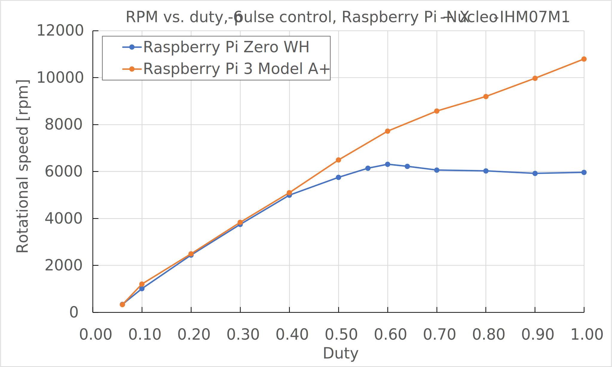

# bldc6p
Driving a blushless DC (BLDC) motor with Raspberry Pi

## Introduction
This is a trial to drive a BLDC motor, in the 6-pulse control mode, by a Raspberry Pi using the pigpio library.
Some of the Raspberry Pi's GPIO pins are connected to an STMicroelectronics X-NUCLEO-IHM07M1, a motor driver board, to control the three-phase inverter.
You need to "sudo" to run this program.


The schematic above shows connections between the Raspberry Pi and the X-NUCLEO-IHM07M1 along with a Hall sensor board available from CQ Publishing in Japan (https://shop.cqpub.co.jp/hanbai/books/I/I000346.html).
GPIO12, 13, and 18 pins have been chosen for the signals IN1, IN2, and IN3 because they support hardware PWM.
GPIO16, 20, and 21 pins have been chosen for the signals EN1, EN2, and EN3 because they are set as inputs and pulled-down at power-on of the Raspberry Pi, before being set as outputs by this program. Note that all the GPIO pins of Raspberry Pi are set as inputs at power-on, but some pins are pulled-up to 3.3 volts, resulting in unwanted gate-deblock if they were connected to EN1, EN2, or EN3. Thus, those pins have been avoided.


The photo above shows the situation where the original Nucleo F302R8 was removed and instead the Raspberry Pi 3 Model A+ was connected to the X-NUCLEO-IHM07M1. Connections were made with jumper wires for breadboards making some pins are vulnerable for spontaneous disconnection. Be careful. If succeeded in connection, the BLDC motor starts to rotate as you type commands from the terminal as mentioned below, e.g., via ssh.

I have uploaded a YouTube video to show the operation of the circuit and program. See below.

https://www.youtube.com/embed/YRLl7kJJlfI

## Ussage
As neither push buttons nor displays are equipped in the circuit diagram above, all controls are done through shell.
If launch the software, you will see the message below.

```
=====================================================
 bldc6p - BLDC motor 6-pulse control by Raspberry Pi
 (c) 2021 @RR_Inyo
=====================================================
Commands:
  s: Start motor
  h: Stop motor
  r: Raise modulation index
  l: Lower modulation index
  t: Show rotational speed
  e: End this program
Setting GPIO pins...
bldc6p>>
```
You can enter your command after the prompt `bldc6p>>'.

If you enter `s`, the program tries to start the motor by forced-commutation for a short period of time and to make a transition to the 6-pulse control using the signals from the Hall sensors. The default initial duty is 0.4. You can raise or lower the duty by the command `r` and `l`, respectively. The command `h` will stop (halt) the motor by gate-blocking the motor drive inverter. Typing the command `t` shows rotational speed in [rpm] which measures time between the beginning of Sector 1 to the next beggining of Sector 1 by gpioGetTick() function. It shuld be noted that result from the `t` command can contain error as processing the shell, or ssh if remotely controlled, affects motor rotation. Finally, the command `e` ends the program. It is recommended to stop the motor before ending the program.

## Principle and characteristics
This program drives the BLDC motor by the signals from the Hall sensors which are connecte to GPIOs of the Raspberry Pi. A rising or falling edge of any of the three Hall sensor signals triggers interruption to call a callback function by means of the gpioSetISRFunc() function. The callback function judges the current sector and call another function to produce the gate signals from the Raspberry Pi to X-NUCLEO-IHM07M1. As mentioned above, the GPIO pins (GPIO12, 13, and 18) connected to IN1, IN2, and IN3 of X-NUCLEO-IHM07M1 support hardware PWM. The default carrier frequency is 15 kHz.

As the Raspberry Pi is a Linux computer, there are many processes running simultaneously. Thus, the CPU of the Raspberry Pi may be taken to different process while running the motor, which makes a disturbance. With a multicore Raspberry Pi, the disturbance is smaller. In addition, response time of the interruption from the rising or falling edge of a Hall sensor signal to the entrance to the callback function may vary depending on the single- or multi-core Raspberry Pi.



For example, the figure above shows the relationship between the duty and the rotational speed in [rpm]. This is a test result with a DC voltage of 9 V (with a testbed shown in the photo above) With the single-core Raspberry Pi Zero WH the rotational speed is sturated around 6,000 rpm while it reaches above 10,000 rpm with the four-core Raspberry Pi 3 A+. This difference resulted from the response time of the interruption.

Actucally, I was trying to do this with a Python program. Could it be fun to drive a motor with an interpreter language like Python? Unfortunately, the current Raspberry Pi cannot do it due to too long an interraption response time even using the pigpio Python module. Thus, I wrote a C program instead.
