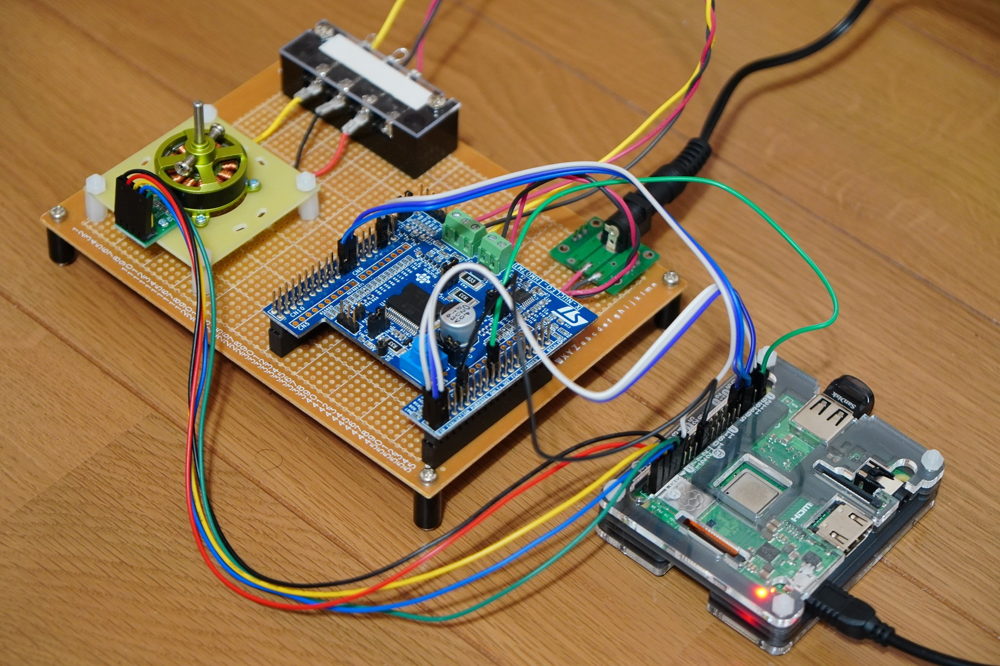

# bldc6p
Driving a blushless DC (BLDC) motor with Raspberry Pi

This is a trial to drive a BLDC motor, in the 6-pulse control mode, by a Raspberry Pi using the pigpio library.
Some of the Raspberry Pi's GPIO pins are connected to an STMicroelectronics X-NUCLEO-IHM001, a motor driver board, to control the three-phase inverter.
You need to "sudo" to run this program.

The schematic above shows connections between the Raspberry Pi and the X-NUCLEO-IHM001 along with a HallCancel Changes sensor board available from CQ Publishing in Japan.
GPIO12, 13, and 18 pins have been chosen for the signals IN1, IN2, and IN3 because they support hardware PWM.
GPIO16, 20, and 21 pins have been chosen for the signals EN1, EN2, and EN2 because they are set as inputs and pulled-down at power-on of the Raspberry Pi, before being set as outputs by this program. Note that all the GPIO pins of Raspberry Pi are set as inputs at power-on, but some pins are pulled-up to 3.3 volts, resulting in unwanted gate-deblock if they were connected to EN1, EN2, or EN3. Thus, those pins have been avoided.

The photo above shows the situation where the original Nucleo F302R8 was removed and instead a Raspberry Pi 3 Model A+ was connected to a X-NUCLEO-IHM001. Connections were made with jumper wires for breadboards making some pins are vulnerable for spontaneous disconnection. Be careful. If succeeded in connection, the BLDC motor starts to rotate as you command from the terminal, e.g., via SSH.

I have uploaded a YouTube video to show the operation of the circuit and program. See below.

https://www.youtube.com/embed/YRLl7kJJlfI
